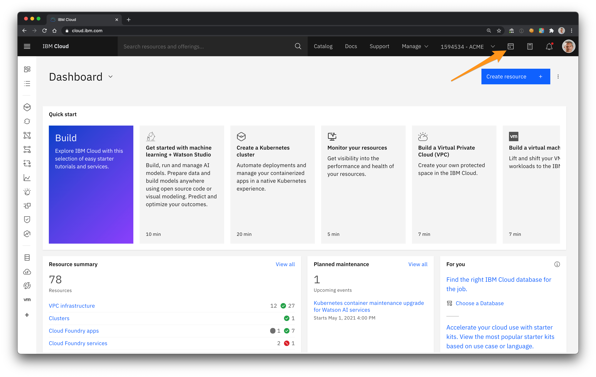
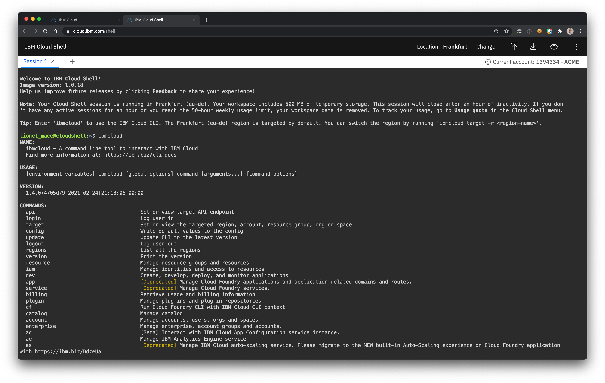

# Connect to IBM Cloud

In this section, you will use the IBM Cloud CLI to connect to the cluster.

 IBM Cloud gives you a personal cloud-based shell workspace with the full IBM Cloud CLI and tons of command-line tools - no installation needed.
 If you prefer to use your own terminal, make sure to perform the [Pre-Requisites](./prepare-prereq.md). 

# Use the Cloud Shell

1. Make sure youre logged in to the [IBM Cloud](http://cloud.ibm.com).

1. To get started, click the Cloud Shell icon in the IBM Cloud console menu bar.

    

1. A new windonw will open. You are now logged in IBM Cloud and you can run commands such git, kubectl

    

1. List the clusters in the account

    ```
    ibmcloud ks clusters
    ```

# Connect to IBM Cloud using the CLI

1. Select your cloud account or the one provided by the trainer.

1. Login to IBM Cloud
    ```sh
    ibmcloud login
    ```

1. Enter your IBMid email and password.

     If you are using a Single-Sign-On authentication with IBMid, use ibmcloud login --sso. 

1. Select an **Account** and a **Region**.

1. Once logged in you will see the following message:
    ```
    Targeted account IBM's Account (0b123456789) <-> 1594534

    API endpoint:      https://cloud.ibm.com
    Region:            eu-de
    User:              your-email-address@company.com
    Account:           IBM's Account (0b123456789) <-> 1594534
    Resource group:    No resource group targeted, use 'ic target -g RESOURCE_GROUP'
    CF API endpoint:
    Org:
    Space:
    ```

    > If you need to switch to anoher region such as Frankfurt, run the command **ibmcloud target -r eu-de**.