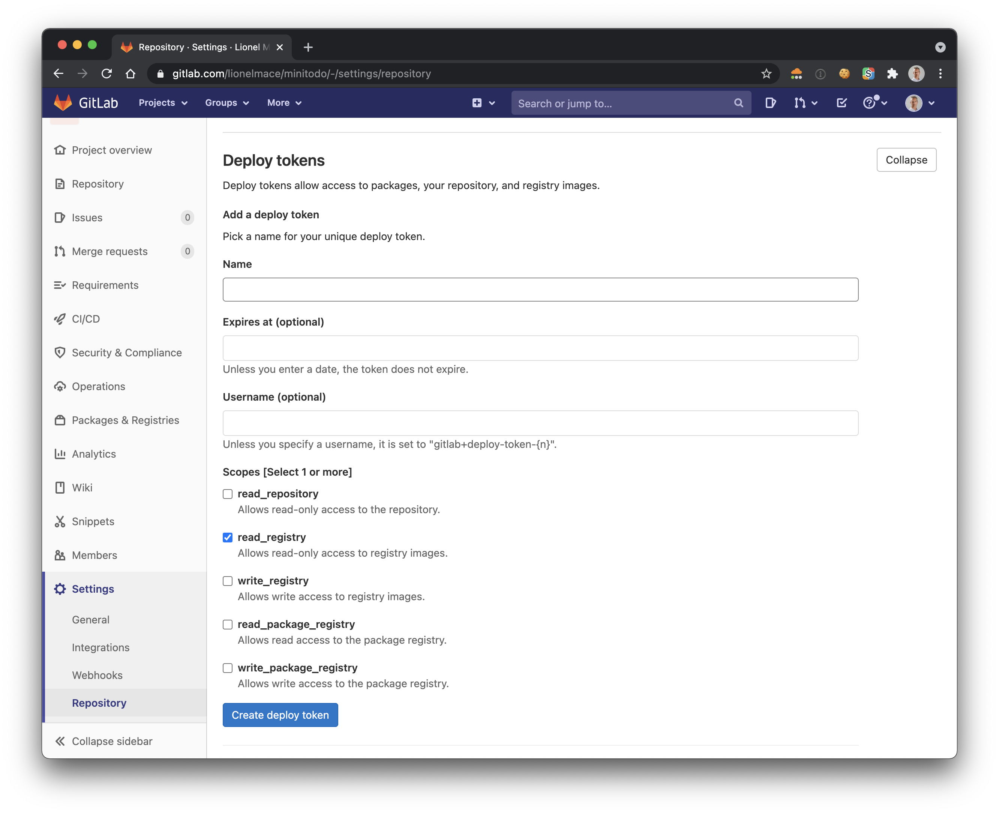

# Using Gitlab Registry with Kubernetes

First of all, you will push a docker image into the Gitlab registry. Then, we will pull this image from the registry to deploy it into our kubernetes cluster.

## Push an image to the Gitlab registry

1. Login to the Gitlab Container Registry

    ```sh
    docker login registry.gitlab.com
    ```

1. Build a docker image

    ```sh
    docker build -t registry.gitlab.com/lionelmace/minitodo .
    ```

1. Push a docker image to the Gitlab Container Registry

    ```sh
    docker push registry.gitlab.com/lionelmace/minitodo
    ```

## Acess the GitLab Container Registry from IKS

1. Create a Deploy Token with only `read_registry` box ticked. To do so, go to the repository Advanced Settings.

    

1. Store the token values in those variables

    ```sh
    export REGISTRY_USERNAME=
    export REGISTRY_PASSWORD=
    export REGISTRY_EMAIL=
    ```

1. Store the credentials in a base64 encoded format.

    ```sh
    export BASE_64_BASIC_AUTH_CREDENTIALS=$(echo -n "$REGISTRY_USERNAME:$REGISTRY_PASSWORD" | base64)
    ```

1. Create a file `.dockerconfigjson`

    ```sh
    touch .dockerconfigjson
    ```

1. Populate the mentioned json format below

    ```sh
    cat << EOF > .dockerconfigjson
    {
        "auths": {
            "https://registry.gitlab.com": {
                "username":"$REGISTRY_USERNAME",
                "password":"$REGISTRY_PASSWORD",
                "email":"$REGISTRY_EMAIL",
                "auth":"$BASE_64_BASIC_AUTH_CREDENTIALS"
            }
        }
    }
    EOF
    ```

1. Encode the file in base64 for the Kubernetes secret

    ```sh
    export BASE_64_ENCODED_DOCKER_FILE=$(cat .dockerconfigjson | base64)
    ```

1. Create a Kubernetes secret

    ```yaml
    cat <<EOF | kubectl apply -f -
    apiVersion: v1
    kind: Secret
    metadata:
      name: registry-credentials
      namespace: default
    type: kubernetes.io/dockerconfigjson
    data:
      .dockerconfigjson: $BASE_64_ENCODED_DOCKER_FILE
    EOF
    ```

1. Add the ImagePullSecrets to the cluster by specifying the default service account with imagePullSecrets

    ```yaml
    cat <<EOF | kubectl apply -f -
    apiVersion: v1
    kind: ServiceAccount
    metadata:
      name: default
      namespace: default
    imagePullSecrets:
    - name: registry-credentials
    EOF
    ```

## Deploy the app

1. Update the deployment file to reference the docker image in the Gitlab registry. The deployment should look somethin like this:

    ```yaml
    ---
    apiVersion: apps/v1
    kind: Deployment
    metadata:
    name: mytodo
    spec:
    replicas: 2
    selector:
        matchLabels:
        app: mytodo
    template:
        metadata:
        labels:
            app: mytodo
            tier: frontend
        spec:
        containers:
        - name: mytodo
            image: registry.gitlab.com/<my-docker-image>:1.0
            imagePullPolicy: Always
            resources:
            requests:
                cpu: 250m     # 250 millicores = 1/4 core
                memory: 128Mi # 128 MB
            limits:
                cpu: 500m
                memory: 384Mi
    ```

1. Redeploy your app

    ```sh
    kubectl apply -f iks/my-deploy-app.yml
    ```
