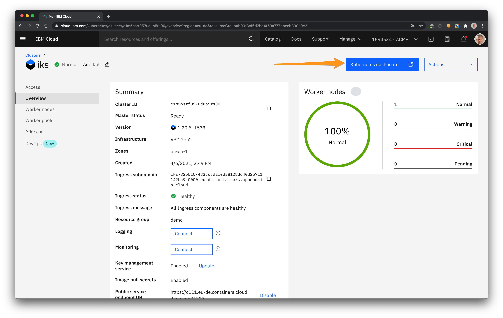
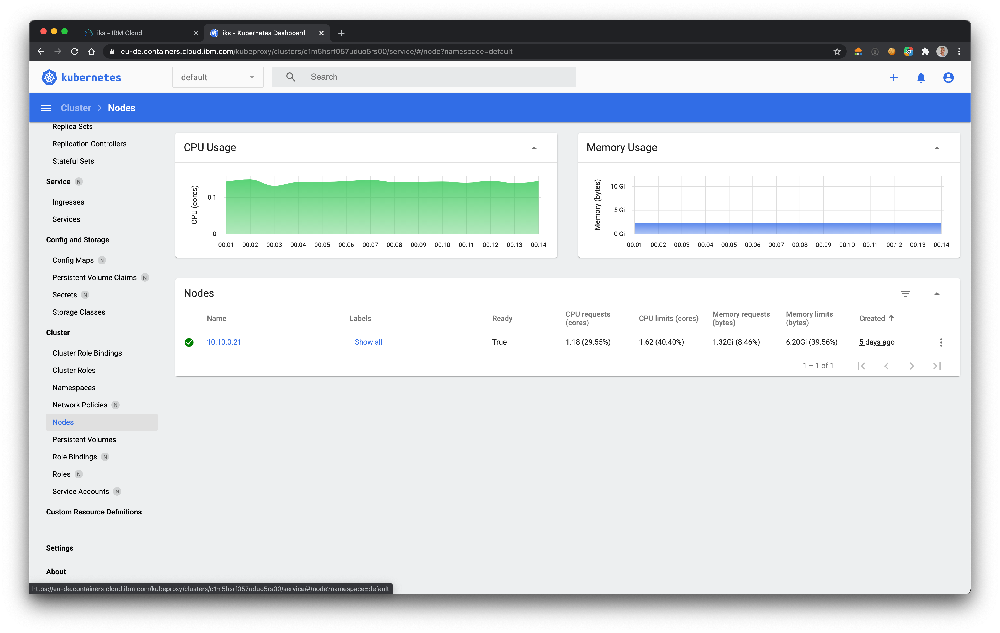

# Kubernetes Dashboard

Dashboard is a web-based Kubernetes user interface. You can use Dashboard to
* deploy containerized applications to a Kubernetes cluster
* troubleshoot your containerized application
* manage the cluster resources
* get an overview of applications running on your cluster
* create or modify individual Kubernetes resources (such as Deployments, Jobs, DaemonSets, etc)
* scale a Deployment
* initiate a rolling update
* restart a pod or deploy new applications using a deploy wizard.

IKS provides you with a direct access to the Dashboard.

1. On the cluster Overview, click **Kubernetes Dashboard** to launch the dashboard in a new tab.

   

1. Select **Nodes** on the left pane, click the **Name** of the nodes and see the **Allocation Resources** to see the health of your nodes.

   
