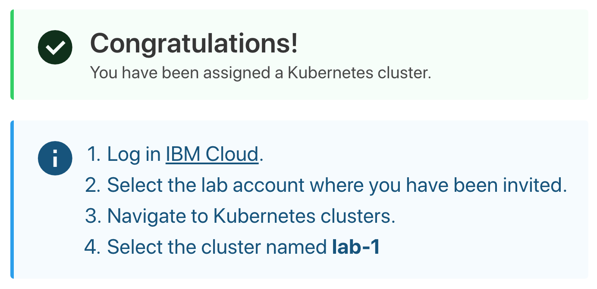

# Get a cluster

In this section, you will either use your own cluster or get access to a IBM Cloud Lab account which contains pre-provisioned clusters. Each lab attendee should have access to one cluster.

 If you're doing this lab on your own, you will need to create your own cluster by following the next section **Create a Kubernetes cluster** to create your own cluster.

## Create a Kubernetes cluster

1. Create a Standard cluster [https://cloud.ibm.com/kubernetes/catalog/create](https://cloud.ibm.com/kubernetes/catalog/create)

    * Number of worker: 1
    * Worker flavor: cx2.2x4
    * Kube version: 1.20.5


1. The cluster can be created by CLI
    ```
    ibmcloud ks cluster create classic --name mycluster --zone fra04 --flavor cx2.2x4 --workers 1 --version 1.20.5
    ```
    If you already have a public and private vlans, you would need this command
    ```
    ibmcloud ks cluster create classic --name mycluster --zone <zone> --flavor <flavor> --workers 1 --version <version> --private-vlan <vlan-id> --public-vlan <vlan-id>
    ```
    For example:
    ```
    ibmcloud ks cluster create classic --name mycluster --zone fra04 --flavor u3c.2x4 --workers 1 --version 1.17.4 --private-vlan 2700262 --public-vlan 2700260
    ```

## Get a Kubernetes cluster

1. Go to the web page given by the instructor and enter your IBM ID (the email you used to sign up) and the lab key given by the trainer.

    

1. **Submit**. You will be added to the Lab account and granted access to a cluster.

    

## Verify your access to the cluster

1. Refresh your [IBM Cloud Dashboard](http://cloud.ibm.com)

1. Select the lab account when you have been invited by clicking on the account selection drop down in the top nav bar.

1. Click on **View all** in the Resource Summary tile.

1. Under **Kubernetes Clusters**, click on the cluster that has been assigned to you.

1. Launch the **Kubernetes Clusters** and have a look around! You can come back to this dashboard throughout your lab.

    

You will use this cluster for this lab. Note that this is a Standard/Paid cluster (as opposed to a FREE cluster.)

With a standard cluster, you can:

* Guard against zone failures with mutltizone clusters.
* React to workload changes with automatic load balancing and scaling of apps and worker nodes.
* Expose apps with stable IPs and domains, and manage network traffic with Istio.