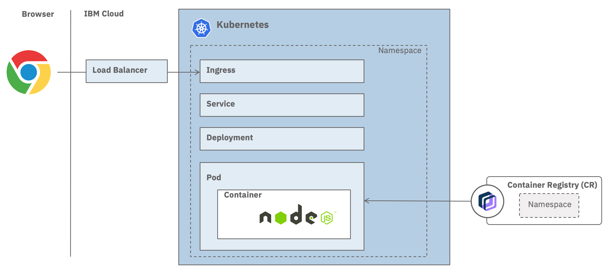

# Deploy the app in your cluster

Different ways exist to make your app accessible from the internet. To choose the best networking option for your application, you can follow the decision tree available [here](https://cloud.ibm.com/docs/containers?topic=containers-cs_network_planning).

In this lab, we will test the **Ingress**, which a NGINX based reverse proxy.



## Deploy with Ingress

1. Navigate to the folder **kubernetes**.

    ```sh
    cd cloud/kubernetes
    ```

1. Replace the cluster-name (including <>) with the the cluster name.

    ```sh
    export IKS_CLUSTER_NAME=<cluster-name>
    ```

1. View the details of a cluster

    ```sh
    ibmcloud ks cluster get -c $IKS_CLUSTER_NAME
    ```

1. Set the values of both the ingress subdomain and the ingress secret of your cluster. Those values will be used in the deployment yaml later.

    ```sh
    export IKS_INGRESS_URL=$(ic ks cluster get -c $IKS_CLUSTER_NAME | grep "Ingress Subdomain" | awk '{print tolower($3)}')
    export IKS_INGRESS_SECRET=$(ic ks cluster get -c $IKS_CLUSTER_NAME | grep "Ingress Secret" | awk '{print tolower($3)}')
    ```

1. Verify the values you set

    ```sh
    echo $IKS_INGRESS_URL
    echo $IKS_INGRESS_SECRET
    ```

    Output should be similar to this

    ```txt
    iks-325510-483cccd2f0d38128dd40d2b711142ba9-0000.eu-de.containers.appdomain.cloud
    iks-325510-483cccd2f0d38128dd40d2b711142ba9-0000
    ```

1. Set the path to the docker image in the IBM Cloud Container Registry. Replace the registry-region and the registry-namespace (including <>).

    ```sh
    export DOCKER_IMG=<registry-region>.icr.io/<registry-namespace>/<docker-image-name>:<docker-tag>
    ```
  
    Example:

    ```sh
    export DOCKER_IMG=de.icr.io/mace/mytodo:1.0
    ```

1. Deploy the container into your cluster.
  
    ```sh
    kubectl apply -f - <<EOF
    ---
     # Application to deploy
    apiVersion: apps/v1
    kind: Deployment
    metadata:
      name: mytodo
    spec:
      replicas: 2 # tells deployment to run 2 pods matching the template
      selector:
        matchLabels:
          app: mytodo
      template:   # create pods using pod definition in this template
        metadata:
          labels:
            app: mytodo
            tier: frontend
        spec:
          containers:
          - name: mytodo
            image: $DOCKER_IMG
            imagePullPolicy: Always
            resources:
              requests:
                cpu: 250m     # 250 millicores = 1/4 core
                memory: 128Mi # 128 MB
              limits:
                cpu: 500m
                memory: 384Mi
            # envFrom:
            # - secretRef:
            #     name: database-credentials    
    ---
    apiVersion: networking.k8s.io/v1
    kind: Ingress
    metadata:
      name: mytodo-ingress
      annotations:
        kubernetes.io/ingress.class: "public-iks-k8s-nginx"
        # kubernetes.io/ingress.class: "private-iks-k8s-nginx"
    spec:
      tls:
      - hosts:
        - $IKS_INGRESS_URL
        secretName: $IKS_INGRESS_SECRET
      rules:
      - host: $IKS_INGRESS_URL
        http:
          paths:
          - path: /
            pathType: Prefix
            backend:
              service:
                name: mytodo
                port:
                  number: 8080
    ---
     # Service to expose frontend
    apiVersion: v1
    kind: Service
    metadata:
      name: mytodo
      labels:
        app: mytodo
        tier: frontend
    spec:
      ports:
      - protocol: TCP
        port: 8080
      selector:
        app: mytodo
        tier: frontend
    EOF
    ```

    Output example:
    deployment.apps/mytodo created
    ingress.extensions/mytodo-ingress created
    service/mytodo created

1. Open a browser and check out the app with the following URL:

    ```sh
    open https://$IKS_INGRESS_URL
    ```
  
    Example:
    https://iks-871966-483cccd2f0d38128dd40d2b711142ba9-0000.eu-de.containers.appdomain.cloud/

Unless a namespase is specified, any kubernetes deployment is done in the namespace **default**. A best practise is to create a new namespace for this deployment. To learn how to use a custom namespace, you can follow those [instructions](./deploy-app-custom-ns). 

## Resources

* [Copying an existing image pull secret from the default namespace to new namespace](https://cloud.ibm.com/docs/containers?topic=containers-registry#copy_imagePullSecret)
* [Storing the image pull secret in the Kubernetes service account for the selected namespace](https://cloud.ibm.com/docs/containers?topic=containers-registry#store_imagePullSecret)