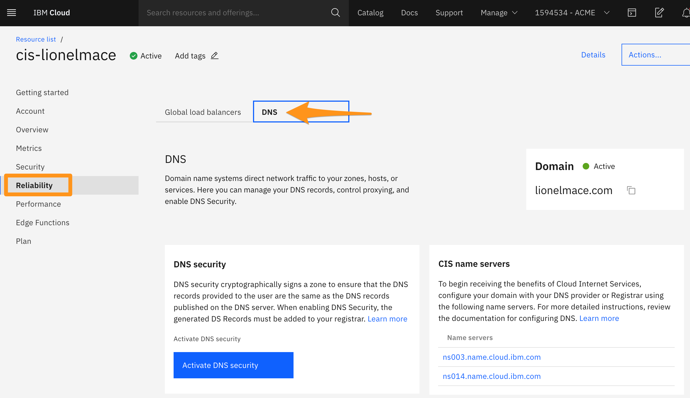
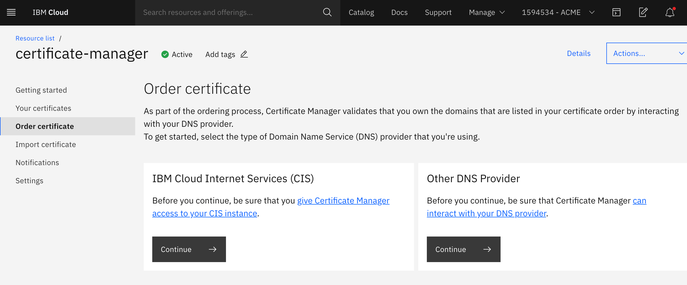
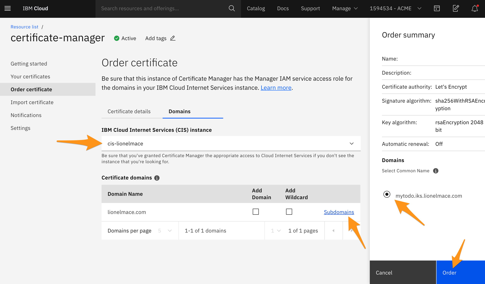
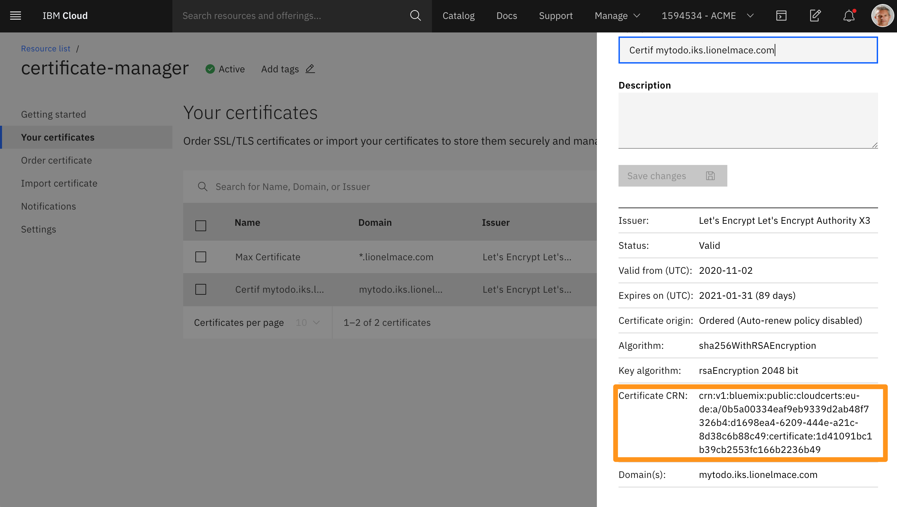

# Using Custom URLs for your app by adding Alternate Domain Names (CNAMEs)

In Cloud Internet Services, an alternate domain name, also known as a CNAME, lets you use your own domain name (for example, www.example.com) in your app’ URL instead of using the domain name that IKS assigns to your cluster.

In this section, we will leverage two IBM Cloud Services:
    * [CIS - Cloud Internet Services](https://cloud.ibm.com/catalog/services/internet-services) which includes Domain Name Service (DNS), Global Load Balancer (GLB), Distributed Denial of Service (DDoS) protection, Web Application Firewall (WAF), etc.

    * [Certificate Manager](https://cloud.ibm.com/catalog/services/certificate-manager) to order and manage SSL/TLS certificates.

## Add a DNS record with CIS

To create a custom domain, you will need an instance of CIS and the hostname of your VPC Load Balancer created automatically during the cluster provisioning.

1. You will need an instance of [CIS - Cloud Internet Services](https://cloud.ibm.com/catalog/services/internet-services). You can create one for free.

1. Retrieve the cluster ID

    ```sh
    ibmcloud ks cluster get -c <cluster-name> | grep ID
    ```

1. Retrieve the LB ID

    ```sh
    ibmcloud is lbs | grep <cluster-id>
    ```

1. Retrieve the VPC LB hostname

    ```sh
    ibmcloud is lb <vpc-lb-id> --output json | grep hostname
    ```

1. To create a new domain, go to Reliability > DNS.

    

1. Add a DNS record with the following information:

    * Type:  `CNAME`
    * Name:  `mytodo.example.com`
    * Alias: `Your VPC LB hostname`

## Order a TLS certificate for the new domain

1. Create a free instance of [Certificate Manager](https://cloud.ibm.com/catalog/services/certificate-manager)

1. Authorize Certificate Manager to access Cloud Internet Services
https://cloud.ibm.com/docs/certificate-manager?topic=certificate-manager-ordering-certificates#cis

1. In the instance of Certificate Manager, order a new Certificate, select Cloud Internet Services.

    

1. Select your CIS instance and click sub-domain. You should see the CNAME you created in CIS.

    

1. Get your certificate CRN

    

## Create a Kubernetes secret to store the TLS certificate

1. Get your cluster id

    ```sh
    ibmcloud ks cluster get -c <cluster-name>
    ```

1. Create a new Kubernetes secret

    ```sh
    ibmcloud ks ingress secret create --name <secret-name> --cluster <cluster-id> --cert-crn <cert-crn>
    ```

    Example:

    ```sh
    ibmcloud ks ingress secret create --name mytodo-iks-cert --cluster c5di7erf0mv7dsr142dg --cert-crn crn:v1:bluemix:public:cloudcerts:eu-de:a/0b5a00334eaf9eb9339d2ab48f7326b4:d1698ea4-6209-444e-a21c-8d38c6b88c49:certificate:42b44eada278448bce72c6a74685ffd3
    ```

1. Verify that your secret was created

    ```sh
    kubectl get secrets -n ibm-cert-store
    ```

## Update the ingress with the new domain

1. Edit your yaml to replace the default domain by the new custom domain.

    ```yaml
    ---
    apiVersion: networking.k8s.io/v1
    kind: Ingress
    metadata:
      name: mytodo-ingress
      namespace: default
      annotations:
        kubernetes.io/ingress.class: "public-iks-k8s-nginx"
        # kubernetes.io/ingress.class: "private-iks-k8s-nginx"
        # Force the use of https if the request is http
        ingress.bluemix.net/redirect-to-https: "True"
    spec:
      tls:
      - hosts:
        - <your-custom-domain>
        secretName: <secret-name>
      rules:
      - host: <your-custom-domain>
        http:
          paths:
          - path: /
            pathType: Prefix
            backend:
              service:
                name: mytodo
                port:
                  number: 8080
    ```

1. Update the new ingress

    ```sh
    kubectl apply -f mytodo.yaml
    ```

    Output should confirm the ingress was changed:
    ```
    deployment.apps/mytodo unchanged
    ingress.extensions/mytodo-ingress configured
    service/mytodo unchanged
    ```

## Open your app in a secure way

1. Open the new url that should have this format

    https://your-custom-domain.com