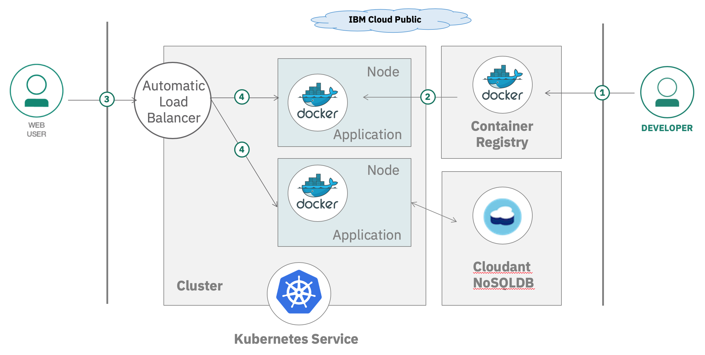

With this lab, you will deploy and manage a Kubernetes cluster in IBM® Cloud Kubernetes Service (IKS). Learn how to automate the deployment, operation, scaling, and monitoring of containerized apps in a cluster.

In this tutorial, you act as a developper. You configure a custom Kubernetes cluster that is used to deploy and test a web application for managing todos. The front end is written in Angular and the reminders are being stored in a Cloudant NoSQL dababase. All run on Node.js, in Docker container managed by Kubernetes.

## Objectives

* Create a cluster with 1 worker pool that has 1 worker node.
* Install the CLIs for running Kubernetes commands and managing Docker images in IBM Cloud Container Registry.
* Create a private image repository in IBM Cloud Container Registry to store your images.
* Add the Cloudant NoSQL DB service to the cluster so that any app in the cluster can use that service.

## Architecture

1. A developer clone an existing web application from Github.
1. Run the application locally and produce a Docker container image.
1. The image is pushed to a namespace in the Container Registry Service.
1. The application is deployed to a Kubernetes cluster.
1. Users access the application.

## Services used

This tutorial uses the following runtimes and services:
* [IBM Cloud Container Registry](https://cloud.ibm.com/containers-kubernetes/launchRegistryView)
* [IBM Cloud Kubernetes Service](https://cloud.ibm.com/containers-kubernetes/catalog/cluster)
* [Continuous Delivery](https://cloud.ibm.com/catalog/services/continuous-delivery)
* [Cloudant](https://cloud.ibm.com/catalog/services/cloudant)
* [IBM Log Analysis with LogDNA](https://cloud.ibm.com/observe/logging/create)
* [IBM Cloud Monitoring with Sysdig](https://cloud.ibm.com/observe/monitoring/create)
