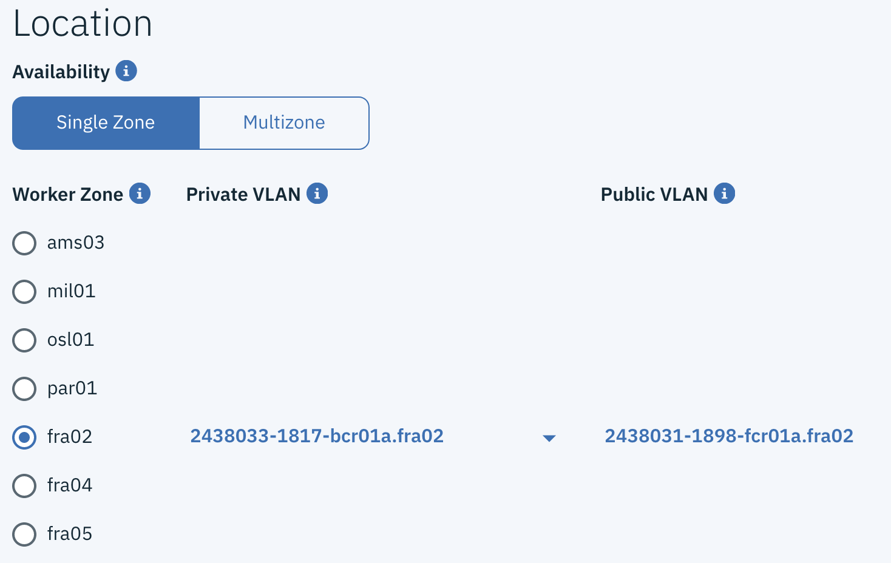
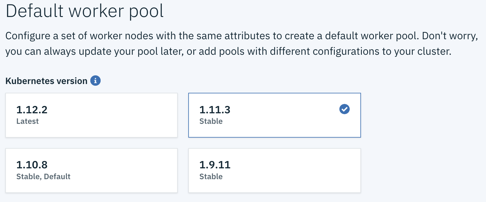
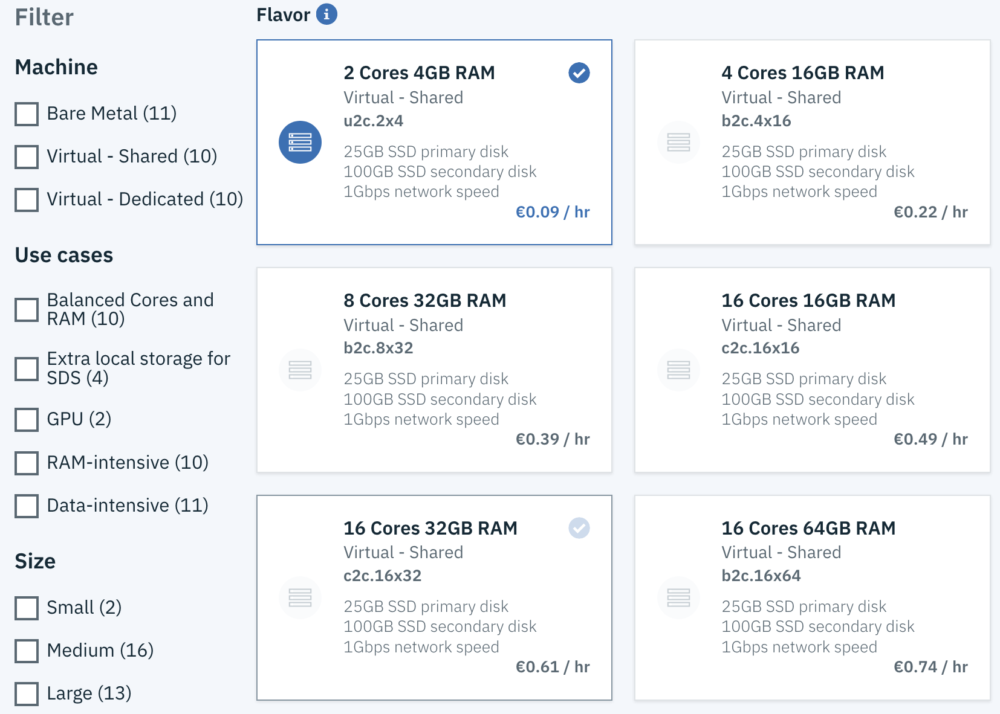
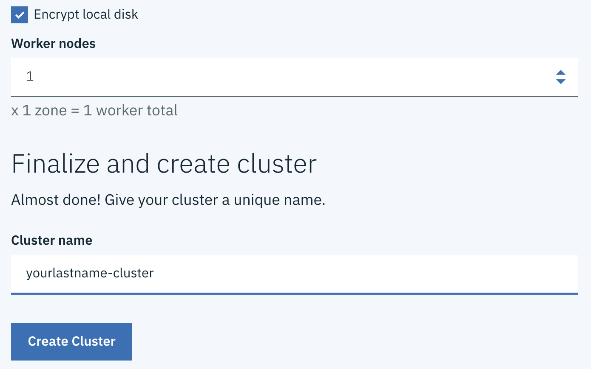

# Create a cluster in the Console

To create a cluster, you have two options either a Lite cluster or a Standard one.

+ A **Lite cluster** is a free cluster comes with a single worker node to deploy container pods upon. A worker node is the compute host, typically a virtual machine, that your apps run on.

+ A **Standard cluster** is a production-ready cluster with as many worker nodes as you want. A Standard cluster requires requires a IBM Cloud Infrastructure account.

The major portion of this lab can be accomplished with a **Free** cluster. Two optional sections relating to Kubernetes Ingress and custom domain require a **Paid** cluster of type **Standard**.

1. Create a Kubernetes cluster from the [Catalog](https://cloud.ibm.com/catalog)

    

1. Vlans

    

1. Version

    

1. Machines

    

1. Number of Worker Nodes

    
