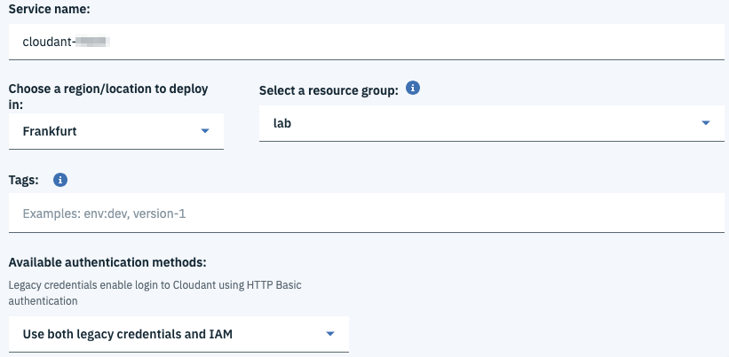

# Step 7 - Use a Kubernetes Secret to connect to a IBM Cloud Service

This web application uses a Cloudant DBaaS to store the todo. We will first create an instance the Cloudant service, then use a Kubernetes Secret to connect to this DBaaS to the cluster.

## Create an instance of Cloudant and its credentials

1. Go to the [Cloud Services Catalog](https://cloud.ibm.com/catalog) 

    > To see all the available services in the catalog using the cli:
    `ibmcloud catalog service-marketplace`

1. Select the service **Cloudant**

1. Create an instance of the service with the plan **Lite**

    

1. Create the credentials to access the service.

    

1. Click New Credentials and keep all the default options

    

1. Copy the Credentials from the console to the file credentials.env  LMA

1. Optional: Create an instance of a service using the CLI instead of the Console.
    ```
    ibmcloud resource service-instance-create <service_instance_name> <service_name> <service_plan_name> <location>
    ```
    Example:
    ```
    ibmcloud resource service-instance-create todo-cloudant cloudant lite eu-de
    ```
    > Warning: Kubernetes Secrets do not accept underscore in the service instance name. LMA true?

    > To create an instance of a service which do not support RG, use the following command: `
    ibmcloud service create <service_name> <service_plan> <service_instance_name>


1. Optional: Verify you see the new instance created using the CLI
    ```
    ic resource service-instances
    ```

## Create the Kubernetes Secret

1. Unless you have created a new namespace, we will use the namespace **default** in this lab. To find the list of Kubernetes namespaces:
    ```
    kubectl get namespaces
    ```
    Output:
    ```
    NAME          STATUS    AGE
    default       Active    7d
    ibm-system    Active    7d
    kube-system   Active    7d
    ```

1. Create the secret used by the application to obtain service credentials:

    ```
    kubectl create secret generic database-credentials --from-env-file=/path/to/credentials.env
    ```
    Result:
    > secret/database-credentials created

1. Control that your secret was successfully created
    ```
    kubectl get secrets
    ```

1. You can view the secret in the Kubernetes Dashboard

    


## Redeploy the app

1. Modify the YML to uncommend href: env LMA
