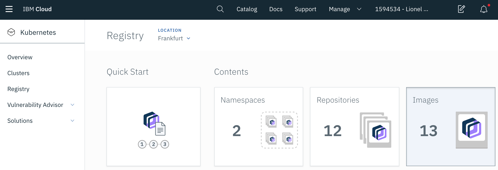

# Build and push the application to the IBM Cloud Container Registry

Before you can run the application on the cluster, you first need to push the Docker image to the IBM Cloud private container registry.

1. Log in to the private **Container Registry** of IBM Cloud. Only required if you haven't `ibmcloud login` before.

    ```sh
    ibmcloud cr login
    ```
    > `ibmcloud cr login` is a wrapper for `docker login` , it is only needed to log your local docker daemon into the registry, which enables you to push/pull images.

1. Retrieve the namespace for the image registry that was created for you.
    ```sh
    ibmcloud cr namespace-list
    ```
    You should get a namespace called **lab-registry**

1. Build a Docker image. Make sure to replace the value region and namespace
    ```sh
    docker build . -t registry.<region>.bluemix.net/<namespace>/todo-<lastname>:1.0
    ```
    > Region is `eu-de` for the Frankfurt datacenter.

1. Push the image to your private image registry.
    ```sh
    docker push registry.<region>.bluemix.net/<namespace>/todo-<lastname>:1.0
    ```

    > If you get the error `unauthorized: authentication required`, run the command `ibmcloud cr login`

1. Verify that the image was successfully added to your registry in your namespace
    ```sh
    ibmcloud cr images --restrict <namespace>
    ```
    Output:
    ```
    Listing images...

    REPOSITORY                                  NAMESPACE   TAG       DIGEST         CREATED        SIZE     VULNERABILITY STATUS
    registry.eu-de.bluemix.net/lab-registry/todo-mace   namespace   1   0d90cb732881   1 minute ago   264 MB   OK
    ``` 

1. The image is also visible in the IBM Cloud Console. Go to the [Container Registry](https://cloud.ibm.com/containers-kubernetes/registry/main/start).

    