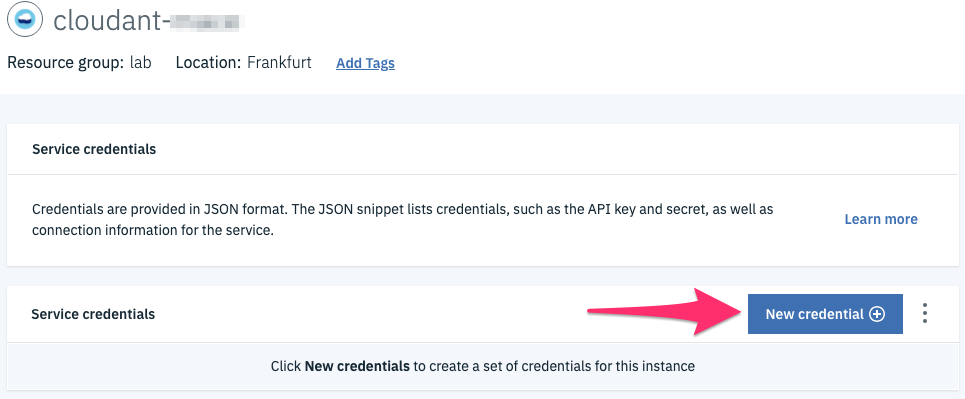

# Use a Kubernetes Secret to connect to a managed Database service.

The initial version of the application uses an in-memory database to store the todo. Yet, the web application can be configured to store the todo in either a Cloudant or a Mongo DBaaS.
We will use a Cloudant DB to demonstrate how to connnect the web app to the  Cloudant service using the Kubernetes Secret.

## Create an instance of Cloudant and its credentials

1. Go to the [Cloud Services Catalog](https://cloud.ibm.com/catalog) 

    > To see all the available services in the catalog using the cli:
    `ibmcloud catalog service-marketplace`

1. Select the service **Cloudant**

1. Create an instance of the service with the plan **Lite**

    

1. Create the credentials to access the service.

    

1. Click **New Credentials** and keep all the default options

    

1. Duplicate the file `credentials.template.env` in the root folder to a new file `credentials.env`

1. Edit the file `credentials.env` and fill out the value for both CLOUDANT_USERNAME and CLOUDANT_APIKEY from the generated credentials above. Make sure you uncomment those 2 lines

1. **Optional**: Create an instance of a service using the CLI instead of the Console.
    ```sh
    ibmcloud resource service-instance-create <service_instance_name> <service_name> <service_plan_name> <location>
    ```
    Example:
    ```
    ibmcloud resource service-instance-create todo-cloudant cloudant lite eu-de
    ```

1. **Optional**: Verify you see the new instance created using the CLI
    ```sh
    ibmcloud resource service-instances
    ```

## Create the Kubernetes Secret

1. Unless you have created a new namespace, we will use the namespace **default** in this lab. To find the list of Kubernetes namespaces:
    ```sh
    kubectl get namespaces
    ```
    Output:
    ```
    NAME          STATUS    AGE
    default       Active    7d
    ibm-system    Active    7d
    kube-system   Active    7d
    ```

1. Create the secret used by the application to obtain service credentials:

    ```sh
    kubectl create secret generic database-credentials --from-env-file=credentials.env
    ```
    Result:
    > secret/database-credentials created

1. Control that your secret was successfully created
    ```sh
    kubectl get secrets
    ```

1. You can view the secret in the Kubernetes Dashboard 

    


## Redeploy the app

1. Modify the YAML to uncomment the last 3 lines of the Deployment section as of **envFrom**.

    Your YAML file should look as follows:
    ```yaml
    ---
    # Application to deploy
    apiVersion: apps/v1
    kind: Deployment
    metadata:
      name: mytodos
    spec:
      replicas: 2 # tells deployment to run 2 pods matching the template
      selector:
        matchLabels:
          app: mytodos
      template:   # create pods using pod definition in this template
        metadata:
          labels:
            app: mytodos
            tier: frontend
        spec:
          containers:
          - name: mytodos
            image: <region>.icr.io/<namespace>/todo-<lastname>:1.0
            imagePullPolicy: Always
            resources:
              requests:
                cpu: 250m     # 250 millicores = 1/4 core
                memory: 128Mi # 128 MB
              limits:
                cpu: 500m
                memory: 384Mi
            envFrom:
            - secretRef:
                name: database-credentials
    ```

1. Update the application with this new configuration
    ```sh
    kubectl apply -f ingress-tls-deploy.yaml
    ```

1. Create a new todo in the web app.

    

1. Check the Cloudant Dashboard to validate this new todo has been persisted in the DB.

    

    

    