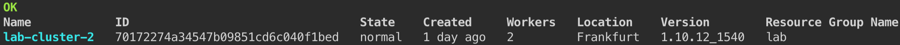

# Connect to your cluster using the Cloud Shell

For this lab, a hosted shell is provided for you with all the necessary tools. Use this web shell to perform the tasks in this lab. If you are having problems with this web shell, you can use a local docker container and follow the instructions here instead.

1. Using Chrome or Firefox, go to the [**Cloud Shell**](https://ibmcloud-workshop.ng.bluemix.net/) and login using the Login button.

1. Passcode is `ibmcl0ud`

1. Click on the Terminal icon to launch your web shell.

    

# Connect to IBM Cloud

1. Login to IBM Cloud
    ```sh
    ibmcloud login
    ```

1. Select the account **Lionel Mace's Account**. 

1. Once logged in you will see the following message:
    ```
    Targeted account Lionel Mace's Account (0b123456789) <-> 1594534

    API endpoint:      https://api.ng.bluemix.net
    Region:            us-south
    User:              lionel.mace@gmail.com
    Account:           Lionel Mace's Account (0b123456789) <-> 1594534
    Resource group:    No resource group targeted, use 'ic target -g RESOURCE_GROUP'
    CF API endpoint:
    Org:
    Space:
    ```

1. By default, you are being logged in the region US South. Switch to the region **EU Central** (eu-de).
    ```sh
    ibmcloud target -r eu-de
    ```

# Target your Resource Group

You need to target a Resource Group (RG) to view your cluster or to add a service (e.g. Cloudant Database later. Access to the group and the resources within it are managed by using Identity and Access Management (IAM). 

1. In this lab, the Resource Group **lab** has been created. Select this resource group.
    ```sh
    ibmcloud target -g lab
    ```

1. Verify you can see your cluster.
    ```sh
    ibmcloud ks clusters
    ```
    Output
    

1. Retrieve the cluster configuration by setting MYCLUSTER environment variable to your cluster name:
    ```sh
    ibmcloud ks cluster-config MY_CLUSTER_NAME
    ```

1. Copy and paste the displayed set command to set the KUBECONFIG environment variable as directed. To verify whether the KUBECONFIG environment variable is set properly or not, run the following command:
    ```sh
    echo $KUBECONFIG
    ```

1. Check that the kubectl command is correctly configured 
    ```sh
    kubectl cluster-info
    ```
    The output should look like:
    

