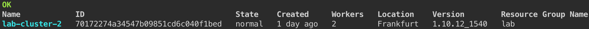
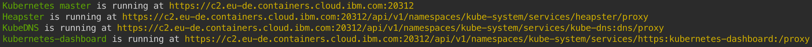

# Connect to your cluster via CLI

For this lab, a hosted shell is provided for you with all the necessary tools. Use this web shell to perform the tasks in this lab. If you are having problems with this web shell, you can use a local docker container and follow the instructions here instead.

1. Using Chrome or Firefox, go to the [**Cloud Shell**](https://cloudshell-console-ikshursley.us-south.cf.cloud.ibm.com).

1. Login using your IBMid email and **Passcode** that has been given during the training.

1. Click on the Terminal icon to launch your web shell.

    

# Connect to IBM Cloud

1. Select your cloud account or the one provided by the trainer.

1. Login to IBM Cloud
    ```sh
    ibmcloud login
    ```

1. Enter your IBMid email and password.

     If you are using a Single-Sign-On authentication with IBMid, use ibmcloud login --sso. 

1. Select an **Account** and a **Region**.

1. Once logged in you will see the following message:
    ```
    Targeted account IBM's Account (0b123456789) <-> 1594534

    API endpoint:      https://cloud.ibm.com
    Region:            eu-de
    User:              your-email-address@company.com
    Account:           IBM's Account (0b123456789) <-> 1594534
    Resource group:    No resource group targeted, use 'ic target -g RESOURCE_GROUP'
    CF API endpoint:
    Org:
    Space:
    ```

    > If you need to switch to anoher region such as Frankfurt, run the command **ibmcloud target -r eu-de**.

# Target your Resource Group

You need to target a Resource Group (RG) to view your cluster or to add a service (e.g. Cloudant Database). Access to the group and the resources within it are managed by using Identity and Access Management (IAM). 

1. In this lab, the Resource Group **lab** has been created. Select this resource group.
    ```sh
    ibmcloud target -g lab
    ```

1. Verify you can see your cluster.
    ```sh
    ibmcloud ks clusters
    ```
    Output
    

1. Retrieve the cluster configuration by setting MYCLUSTER environment variable to your cluster name:
    ```sh
    ibmcloud ks cluster-config MY_CLUSTER_NAME
    ```

1. Copy and paste the displayed set command to set the KUBECONFIG environment variable as directed. 

1. To verify whether the KUBECONFIG environment variable is set properly or not, run the following command:
    ```sh
    echo $KUBECONFIG
    ```

1. Check that the kubectl command is correctly configured 
    ```sh
    kubectl cluster-info
    ```
    The output should look like:
    

