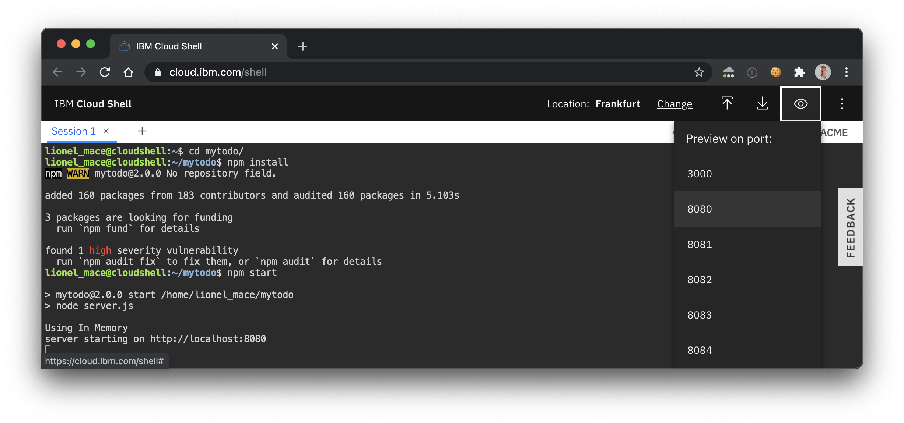
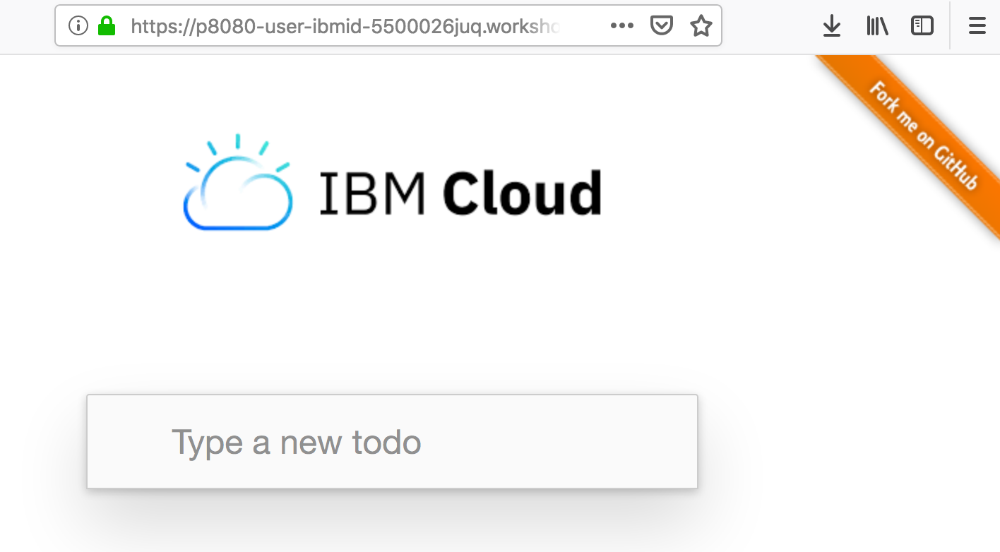

# Get and build the application code

We will use a web application for managing todos. The front end is written in Angular and the reminders are being stored in a in-memory database. All run on Node.js.

1. Clone the source code for the Todo web app.
    ```sh
    git clone https://github.com/lionelmace/mytodo
    ```
    This command creates a directory of your project locally on your disk.

1. Change to the directory of the checkout
    ```sh
    cd mytodo
    ```

1. Get the node.js dependencies for this project
    ```sh
    npm install
    ```

# Run the application locally

1. Run the application locally
    ```sh
    npm start
    ```
    Results:
    ```
    > mytodo@2.0.0 start /Users/mace/Box Sync/Bluemix/technos/temp/mytodo
    > node server.js

    Cannot find module ./vcap-local.json
    Cannot find credentials.env
    Using In Memory
    server starting on http://localhost:8080
    ```

1. After your app starts, click on the eye on the top right corner and select the port **8080** 

    

1. This should open a page as follows:

    

1. Type a new todo to validate. This todo is being stored in memory. Thus restarting the app will delete any todo.

1. Finally, you can stop the app using `Ctrl+C`.