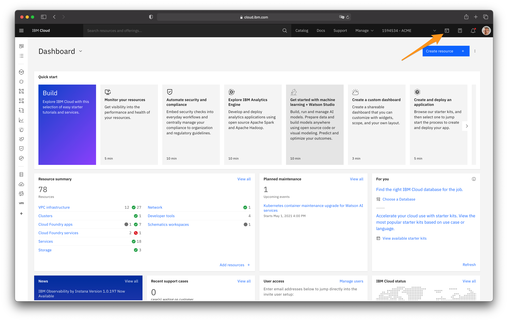
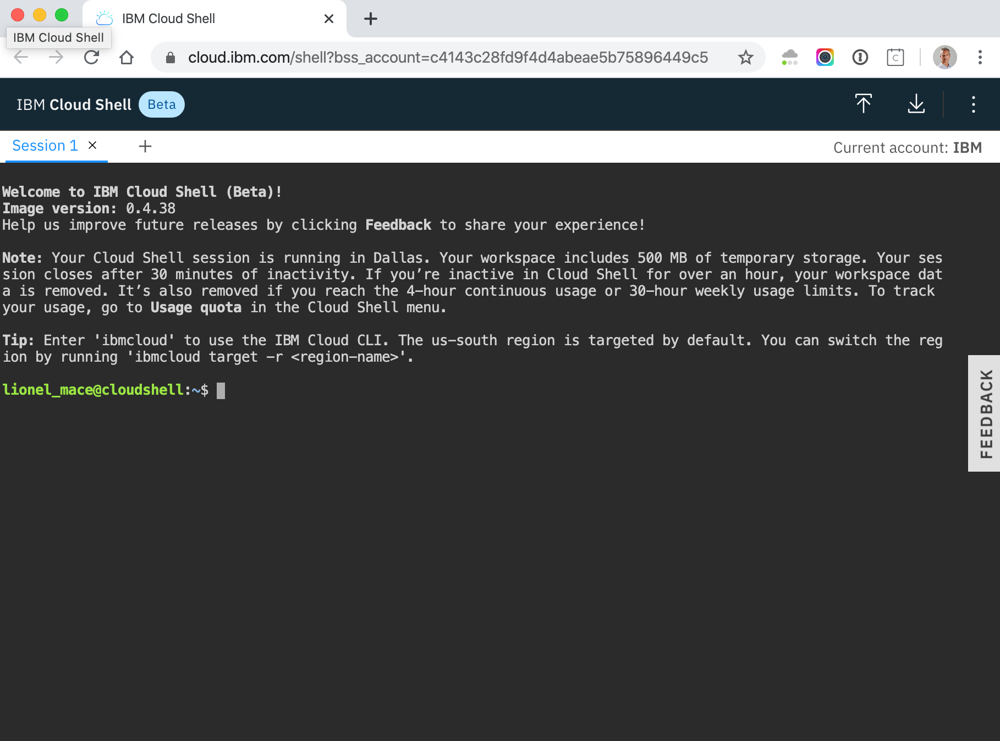

# Connect IBM Cloud Account

In this section, you will create your own IBM Cloud account.

## Login to IBM Cloud

1. Create your own IBM Cloud account.

1. After the email verification, confirm by logging in to https://cloud.ibm.com

## Connect to IBM Cloud using the CLI

1. Log in to the IBM Cloud to access the dashboard.

1. Click on the top right terminal icon to launch the IBM Cloud Shell.

    

1. You are now logged in IBM Cloud and you can run commands such git, kubectl

    

1. List the clusters in the account

    ```
    ibmcloud ks clusters
    ```