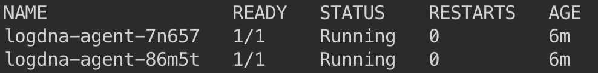

# Logging with LogDNA

IBM Log Analysis with LogDNA is a third-party service that you can include as part of your IBM Cloud architecture to add log management capabilities. IBM Log Analysis with LogDNA is operated by LogDNA in partnership with IBM.

On the IBM Cloud, to configure cluster-level logging for a Kubernetes cluster, you must provision an instance of the IBM Log Analysis with LogDNA service.


## Provision an instance of Log Analysis with LogDNA service

1. Go to the [**Observability** category](https://cloud.ibm.com/observe)

    

1. Select the category **Logging**

1. Click the button **Create logging instance**.

1. Make sure to enter a meaningful name for the service instance such as logdna-<yourinitial>.

1. Select the Resource Group. To better govern your services, it is recommended to use the same Resource Group than the one your cluster is in.

    

1. Choose a service plan for your service instance. By default, the Lite plan is selected for you. The Lite plan is good enough to continue the lab.

    

1. Click **Create**. The Observability dashboard opens and shows the details for your service.

## Configure the LogDNA agent on a cluster.

To configure your Kubernetes cluster to send logs to your IBM Log Analysis with LogDNA instance, you must install a `logdna-agent` pod on each node of your cluster. The LogDNA agent reads log files from the pod where it is installed, and forwards the log data to your LogDNA instance.

1. Click **Edit log sources**

    

1. Select **Kubernetes**.

    

1. Copy the first command and run it in your terminal. In this step, you create a Kubernetes secret to store your logDNA ingestion key for your service instance. The LogDNA ingestion key is used to open a secure web socket to the logDNA ingestion server and to authenticate the logging agent with the logging service. The command looks as follows:
    ```sh
    kubectl create secret generic logdna-agent-key --from-literal=logdna-agent-key=<logDNA_ingestion_key>
    ```

1.  d.	Copy the second command and run it in your termina. In this step, you create a Kubernetes daemon set to deploy the LogDNA agent on every worker node of your Kubernetes cluster. The LogDNA agent collects logs with the extension *.log and extensionsless files that are stored in the /var/log directory of your pod. By default, logs are collected from all namespaces, including kube-system, and automatically forwarded to the IBM Log Analysis with LogDNA service. The command looks as follows:
    ```sh
    kubectl create -f https://repo.logdna.com/ibm/prod/logdna-agent-ds-us-south.yaml
    ```

1. Verify that the LogDNA agent is deployed successfully.
    ```sh
    kubectl get pods
    ```
    Output:

    

    > The deployment is successful when you see one or more LogDNA pods. The number of LogDNA pods equals the number of worker nodes in your cluster. All pods must be in a Running state.

1. To check that the secret containing the access key has been created, you can run the following command:
    ```sh
    kubectl get secrets
    ```

> What logs can you expect to see?
•	Stdout and stderr logs from all containers
•	Application logs
•	Worker (node) logs

By default, logs are collected from all namespaces, including kube-system, and automatically forwarded to the logging service.


## View logs in the LogDNA dashboard

1. At the bottom on the page, click **View LogDNA** to open the LogDNA console

1. Use `namespace:<YOUR_KUBERNETES_NAMESPACE>` to view only the logs of the applications deployed to the specified namespace.

    > Note: With the Free service plan, you can tail your latest logs only.

1. As you go through the next steps, keep an eye on the LogDNA console for new log statements coming from your apps deployed in this namespace.

    


Find more about IBM Log Analysis with LogDNA in the [IBM Cloud documentation](https://cloud.ibm.com/docs/services/Log-Analysis-with-LogDNA/index.html#getting-started).
