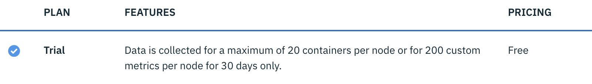
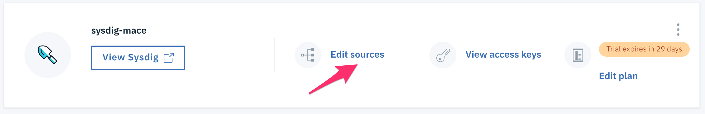
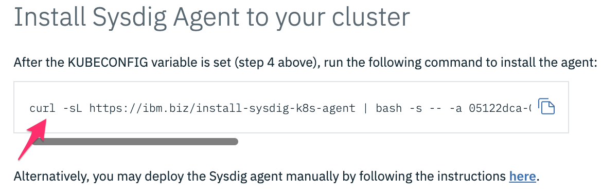

# Monitoring metrics with Sysdig

Sysdig Monitor is part of Sysdig’s container intelligence platform. Sysdig uses a unified platform to deliver security, monitoring, and forensics in a container and microservices-friendly architecture.

Once the agent has started sending metrics to Sysdig for your environment, you can use the Sysdig Monitor UI to view and analyze that data.

## Provision an instance of Monitoring with Sysdig service

1. Go to the [**Observability** category](https://cloud.ibm.com/observe)

    

1. Select the category **Monitoring**

1. Click the button **Create monitoring instance**.

1. Make sure to enter a meaningful name for the service instance such as sysdig-YOURINITIAL.

1. Select the resource group that your cluster is in. By default, the Default resource group is set for you.

    

1. Choose a service plan for your service instance. By default, the Lite plan is selected for you. The Lite plan is good enough to continue the lab.

    

1. Click **Create**. The Observability dashboard opens and shows the details for your service.

## Install Sysdig Agent to your cluster

1. Click **Edit sources**

    

1. Run the following command to install the agent.

    

1. If the installation is successfull you should see the following message:

    ```
    * Detecting operating system
    * Downloading Sysdig cluster role yaml
    * Downloading Sysdig config map yaml
    * Downloading Sysdig daemonset v2 yaml
    * Creating namespace: ibm-observe
    * Creating sysdig-agent serviceaccount in namespace: ibm-observe
    * Creating sysdig-agent clusterrole and binding
    clusterrole.rbac.authorization.k8s.io/sysdig-agent created
    * Creating sysdig-agent secret using the ACCESS_KEY provided
    * Retreiving the IKS Cluster ID and Cluster Name
    * Setting cluster name as hacluster
    * Setting ibm.containers-kubernetes.cluster.id 0d75a523aeec4aba831fbff645bfd223
    * Updating agent configmap and applying to cluster
    * Setting tags
    * Setting collector endpoint
    * Adding additional configuration to dragent.yaml
    * Enabling Prometheus
    configmap/sysdig-agent created
    * Deploying the sysdig agent
    daemonset.extensions/sysdig-agent created
    ```

1. **Optional** Alternatively, you may deploy the Sysdig agent manually by following the instructions [here](https://cloud.ibm.com/docs/services/Monitoring-with-Sysdig/config_agent.html#kube_manually).

## View Sysdig

1. 