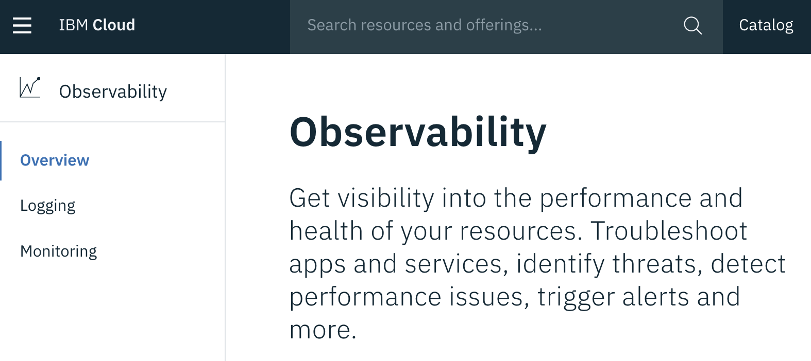

# Monitoring metrics with Sysdig

Sysdig Monitor is part of Sysdig’s container intelligence platform. Sysdig uses a unified platform to deliver security, monitoring, and forensics in a container and microservices-friendly architecture.

Once the agent has started sending metrics to Sysdig for your environment, you can use the Sysdig Monitor UI to view and analyze that data.


## Provision an instance of Monitoring with Sysdig service

1. Go to the [**Observability** category](https://cloud.ibm.com/observe)

    

1. Select the category **Monitoring**

1. Click the button **Create monitoring instance**.

1. Make sure to enter a meaningful name for the service instance such as sysdig-YOURINITIAL.

1. Select the resource group that your cluster is in. By default, the Default resource group is set for you.

    

1. Choose a service plan for your service instance. By default, the Lite plan is selected for you. The Lite plan is good enough to continue the lab.

    

1. Click **Create**. The Observability dashboard opens and shows the details for your service.

## Install Sysdig Agent to your cluster

1. Click **Edit sources**

    

1. Run the following command to install the agent.

    

1. If the installation is successfull you should see the following message:

    ```
    * Detecting operating system
    * Downloading Sysdig cluster role yaml
    * Downloading Sysdig config map yaml
    * Downloading Sysdig daemonset v2 yaml
    * Creating namespace: ibm-observe
    * Creating sysdig-agent serviceaccount in namespace: ibm-observe
    * Creating sysdig-agent clusterrole and binding
    clusterrole.rbac.authorization.k8s.io/sysdig-agent created
    * Creating sysdig-agent secret using the ACCESS_KEY provided
    * Retreiving the IKS Cluster ID and Cluster Name
    * Setting cluster name as hacluster
    * Setting ibm.containers-kubernetes.cluster.id 0d75a523aeec4aba831fbff645bfd223
    * Updating agent configmap and applying to cluster
    * Setting tags
    * Setting collector endpoint
    * Adding additional configuration to dragent.yaml
    * Enabling Prometheus
    configmap/sysdig-agent created
    * Deploying the sysdig agent
    daemonset.extensions/sysdig-agent created
    ```

## Configure Monitoring with Sysdig

To Configure Sysdig to monitor health and performance of your cluster:

1. Click **View Sysdig** and you should see the sysdig monitor UI.

    

1. On the welcome page, click **Next**.

1. Click **Complete onboarding** to see the Explore tab of Sysdig UI.

    

## Monitor your cluster
To check the health and performance of your app amd cluster:

1. Back in the application running at the url below, enter several todos.
    ```
    https://todo.<cluster-name>.eu-de.containers.appdomain.cloud/
    ```

1. Expand <cluster-name> on the left pane > expand **default** namespace > click on **app-log-analysis-deployment** to see the Request count, Response Time etc., on the Sysdig monitor wizard.

    

1. To check the HTTP request-response codes, click on the arrow next to **Kubernetes Pod Health** on the top bar and select **HTTP** under **Applications**. Change the interval to **10 M** on the bottom bar of the Sysdig UI.

1. To monitor the latency of the application,
    * From the Explore tab, select **Deployments and Pods**.
    * Click the arrow next to HTTP and then Select Metrics > Network.
    * Select **net.http.request.time**.
    * Select Time: **Sum** and Group: **Average**.
    * Click **More options** and then click **Topology** icon.
    * Click **Done** and Double click the box to expand the view.

1. To monitor the Kubernetes namespace where the application is running,
    * From the Explore tab, select **Deployments and Pods**.
    * Click the arrow next to `net.http.request.time`.
    * Select Default Dashboards > Kubernetes.
    * Select Kubernetes State > Kubernetes State Overview.