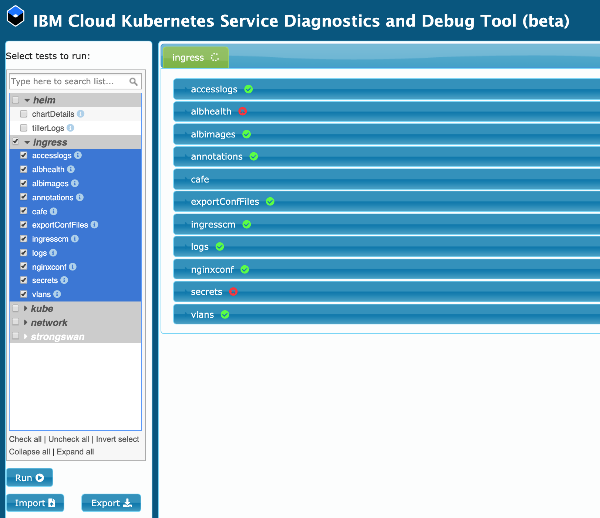

# Troubleshoot and Debug

What techniques for general Ingress troubleshooting and debugging can you consider?

You publicly exposed your app by creating an Ingress resource for your app in your cluster. However, when you try to connect to your app through the ALB's public IP address or subdomain, the connection fails or times out. The steps in the following sections can help you debug your Ingress setup.



## Deploy Run Ingress tests in the IBM Cloud Kubernetes Service Diagnostics and Debug Tool

1. Set up Helm in your cluster, create a service account for Tiller, and add the ibm repository to your Helm instance. You need to do the steps done in Step 4.1.

1. Add the IBM Cloud Helm repositories to your Helm instance.

    ```
    helm repo add iks-charts https://icr.io/helm/iks-charts
    ```
    ```
    helm repo add ibm-charts https://icr.io/helm/ibm-charts
    ```

1. Update the repos to retrieve the latest versions of all Helm charts.

    ```
    helm repo update
    ```

1. List the Helm charts that are currently available in the IBM Cloud repositories.

    ```
    helm search iks-charts
    ```
    ```
    helm search ibm-charts
    ```

1. Install the Helm Debug chart to your cluster.

    ```
    helm install iks-charts/ibmcloud-iks-debug --name debug-tool
    ```

1. Start a proxy server to display the debug tool interface.

    ```
    kubectl proxy --port 8080
    ```

1. In a web browser, open the debug tool interface URL:

    ```
    http://localhost:8080/api/v1/namespaces/default/services/debug-tool-ibmcloud-iks-debug:8822/proxy/page
    ```

1. Select the ingress group of tests. Some tests check for potential warnings, errors, or issues, and some tests only gather information that you can reference while you troubleshoot. For more information about the function of each test, click the information icon next to the test's name.

1. Click **Run**.

1. Check the results of each test.

    * If any test fails, click the information icon next to the test's name in the left-hand column for information about how to resolve the issue.
    * You can also use the results of tests that only gather information while you debug your Ingress service in the following sections.