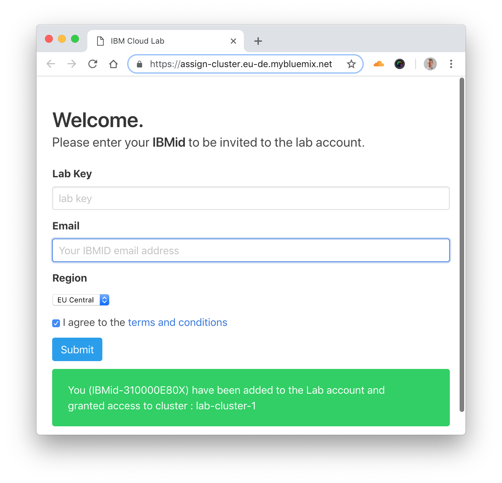
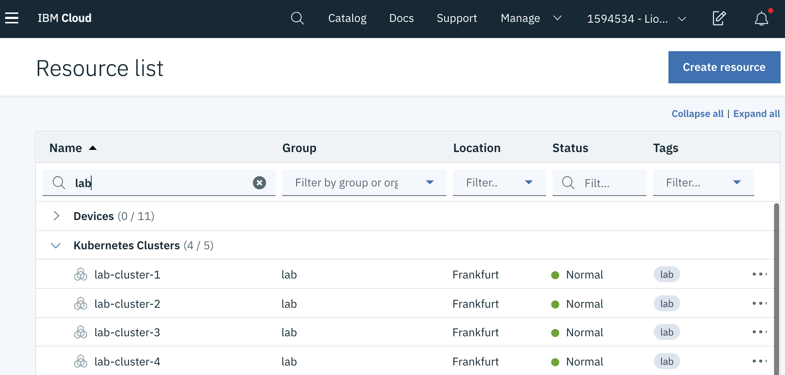

# Create account and get cluster

In this section, you will create your own IBM Cloud account, and then get access to a IBM Cloud Lab account which contains pre-provisioned clusters. Each lab attendee will be granted access to one cluster.

1. Create your own IBM Cloud account.

1. After the email verification, confirm by logging in to https://cloud.ibm.com

1. Go to [Get Cluster](https://assign-cluster.eu-de.mybluemix.net) web page and enter your IBM ID (the email you used to sign up) and the lab key **academy**. Make sure to keep the region **EU Central** where the clusters have been provisioned.

1. Submit. You will be added to the Lab account and granted access to a cluster.

    

1. Refresh your [IBM Cloud Dashboard](http://cloud.ibm.com)

1. Switch to the account **1594534 - Lionel Mace's Account** by clicking on the account selection drop down in the top nav bar.

1. Click on **View all** in the Resource Summary tile.

1. Under **Kubernetes Clusters**, click on the cluster that has been assigned to you.

1. Launch the **Kubernetes Clusters** and have a look around! You can come back to this dashboard throughout your lab.

    

You will use this cluster for this lab. Note that this is a Standard/Paid cluster (as opposed to FREE cluster.)