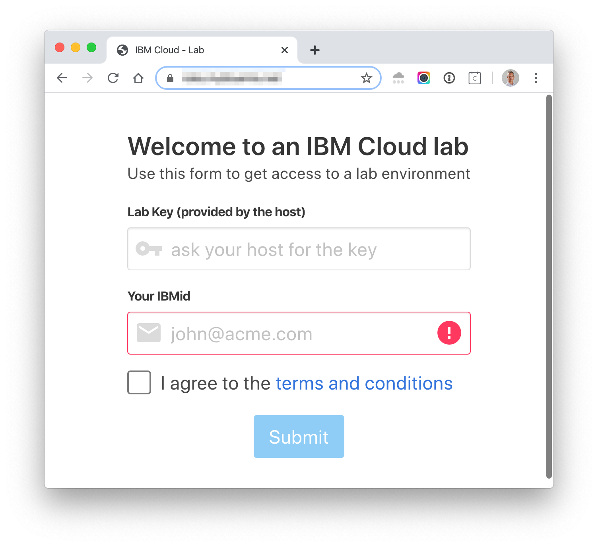

# Create account and get cluster

In this section, you will create your own IBM Cloud account, and then get access to a IBM Cloud Lab account which contains pre-provisioned clusters. Each lab attendee will be granted access to one cluster.

## Login to IBM Cloud

1. Create your own IBM Cloud account.

1. After the email verification, confirm by logging in to https://cloud.ibm.com

## Get a Kubernetes cluster

1. Go to **[Get Cluster](https://assign-cluster.eu-de.mybluemix.net)** web page and enter your IBM ID (the email you used to sign up) and the lab key given by the trainer. Make sure to select the region where the cluster has been provisioned.

    

1. **Submit**. You will be added to the Lab account and granted access to a cluster.

    

## Verify your access to the cluster

1. Refresh your [IBM Cloud Dashboard](http://cloud.ibm.com)

1. Select the lab account when you have been invited by clicking on the account selection drop down in the top nav bar.

1. Click on **View all** in the Resource Summary tile.

1. Under **Kubernetes Clusters**, click on the cluster that has been assigned to you.

1. Launch the **Kubernetes Clusters** and have a look around! You can come back to this dashboard throughout your lab.

    

You will use this cluster for this lab. Note that this is a Standard/Paid cluster (as opposed to FREE cluster.)