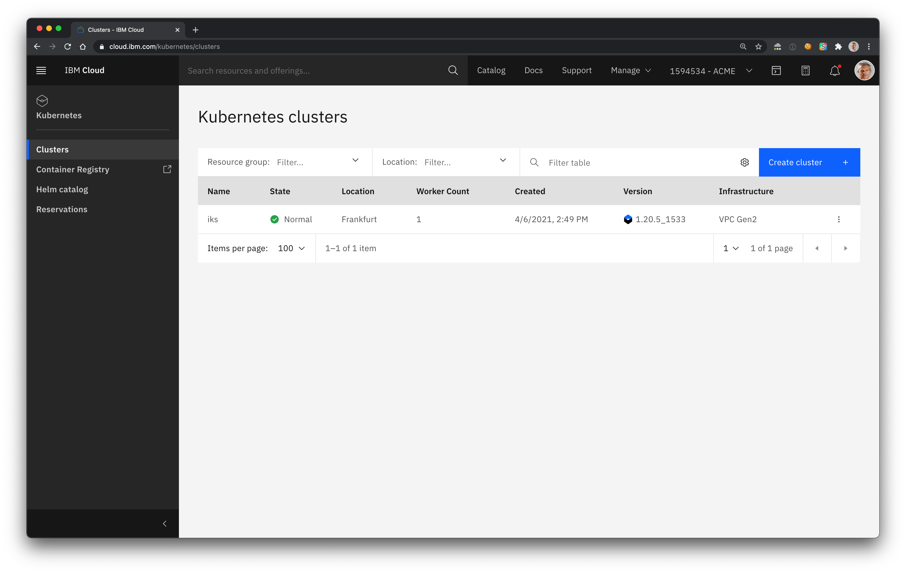
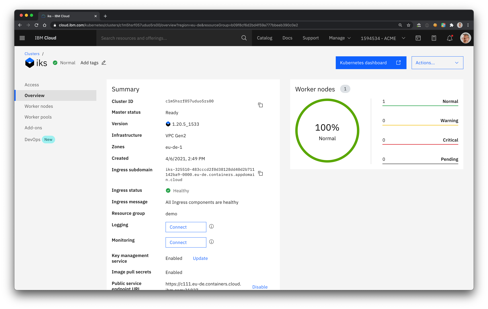

# View your cluster

1. Navigate to the [Kubernetes landing page](https://cloud.ibm.com/containers-kubernetes/landing). This page shows all clusters you have access to.

1. Select the resource group and the location assigned to you.

1. Locate your cluster in the list.

    
    
1. Select the cluster.

The **Overview** page provides critical information about your cluster like:
* the **Cluster ID**,
* the **Kubernetes version** currently deployed,
* the **IBM-provided Ingress subdomain** assigned to the cluster,
* a summary of the **status** of the **worker nodes**,
* links to **Logs** and **Metrics** for the cluster.

