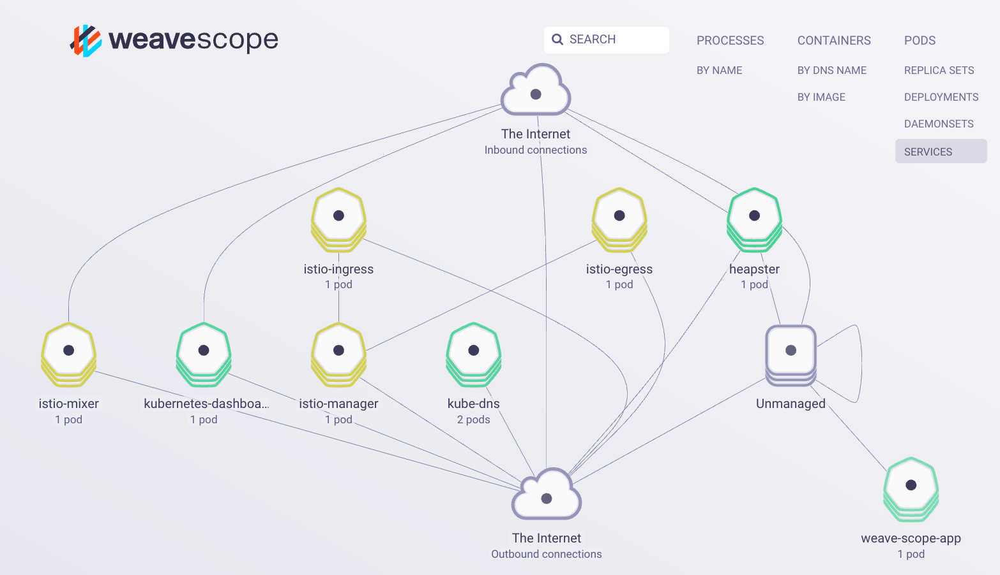

# Optional - Monitor your container with Weave Scope

[Weave scope](https://www.weave.works/docs/scope/latest/introducing/) provides a visual diagram of your resources within the kube cluster including services, pods, containers, processes, nodes, etc. Scope provides you interactive metrics for CPU and Memory and provides tools to tail and exec into a container. Scope is a powerful tool that you do not want to expose on the public internet.



To use weave scope securely with your Kubernetes cluster you can follow these steps.

1. Deploy one of the provided RBAC permissions configuration file in the cluster.
    To enable read/write permissions:
    ```
    kubectl apply -f "https://raw.githubusercontent.com/IBM-Cloud/kube-samples/master/weave-scope/weave-scope-rbac.yaml"
    ```
    To enable read-only permissions:
    ```
    kubectl apply --namespace weave -f "https://raw.githubusercontent.com/IBM-Cloud/kube-samples/master/weave-scope/weave-scope-rbac-readonly.yaml"
    ```

1. Deploy the Weave Scope service, which is privately accessible by the cluster IP address.
    ```
    kubectl apply --namespace weave -f "https://cloud.weave.works/k8s/scope.yaml?k8s-version=$(kubectl version | base64 | tr -d '\n')"
    ```

1. Run a port forwarding command to bring up the service on your computer.
    ```
    kubectl port-forward -n weave "$(kubectl get -n weave pod --selector=weave-scope-component=app -o jsonpath='{.items..metadata.name}')" 4040
    ```

1. Open your web browser to
    <a href="http://localhost:4040" target="_blank">http://localhost:4040</a>

    > Weave Scope is a cpu heavy (especially the app). Scope is best utilized in a large cluster.